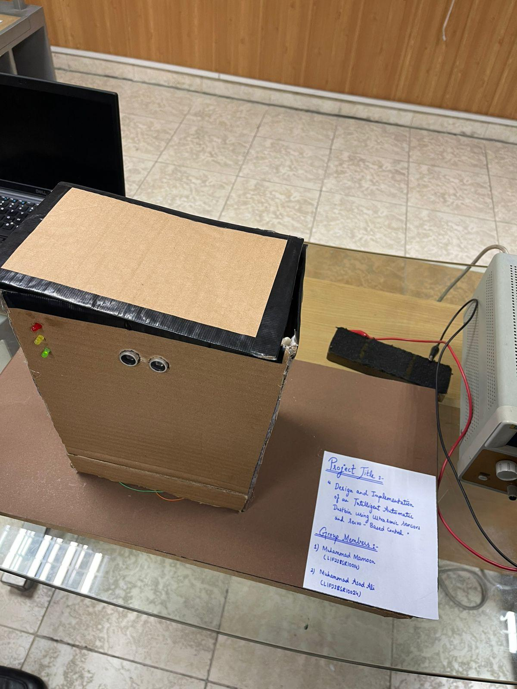

# 🗑️ Intelligent Automatic Dustbin Using Ultrasonic Sensors and Servo-Based Control

An embedded systems project implementing a **contactless, intelligent automatic dustbin** that uses dual ultrasonic sensors for user proximity detection and fill-level monitoring, an MG90s servo motor for lid actuation, and a tri-color LED feedback system — all governed by a **7-state Non-Blocking Finite State Machine (FSM)** running on an ESP32 microcontroller.

> 📄 This project was written up as an **IEEE conference paper**.

---

## 🖼️ Prototype



> Real cardboard-based prototype with Red/Yellow/Green LEDs and HC-SR04 ultrasonic sensors visible on the front panel.

---

## 🧠 System Overview

```
[HC-SR04 Sensor 1]          [HC-SR04 Sensor 2]
  User Detection               Fill Level Monitor
  (External, Front)            (Internal, Top → Down)
         │                            │
         └──────────┬─────────────────┘
                    ▼
           [ESP32 WROOM-32]
           7-State FSM Control
                    │
         ┌──────────┼──────────┐
         ▼          ▼          ▼
   [MG90s Servo]  [Green]  [Yellow]  [Red]
    Lid Control    Normal   Warning   Bin Full
```

---

## 🔄 7-State Finite State Machine

| State | Description | LED | Servo |
|-------|-------------|-----|-------|
| `STATE_IDLE` | Monitoring for user & fill level | 🟢 Green | 0° (Closed) |
| `STATE_LID_OPENING` | Command sent to open lid | 🟢 Green | → 90° |
| `STATE_LID_OPEN` | Lid open for 1200ms disposal window | 🟢 Green | 90° (Open) |
| `STATE_WARNING` | Pre-close alert for 500ms | 🟡 Yellow | 90° (Open) |
| `STATE_SAFETY_CHECK` | Verify path clear before closing | 🟡 Yellow | 90° (Hold) |
| `STATE_LID_CLOSING` | Close lid, 500ms settle time | 🟡 Yellow | → 0° |
| `STATE_BIN_FULL` | Lid locked out until emptied | 🔴 Red | 0° (Closed) |

### State Transition Logic

```
IDLE ──(user detected ≤25cm)──► LID_OPENING ──► LID_OPEN
                                                     │
                              (1200ms elapsed)        │
                                   ▼                  │
                               WARNING ◄──────────────┘
                                   │ (500ms)
                                   ▼
                           SAFETY_CHECK
                          (path clear?)
                           │         │
                          YES        NO (retry 250ms)
                           ▼
                       LID_CLOSING ──► IDLE
                           
IDLE ──(fill ≤8cm)──► BIN_FULL ──(fill >8cm)──► IDLE
```

---

## 📊 Performance Metrics (Experimental Validation)

| Metric | Measured Value |
|--------|---------------|
| User detection accuracy | **98.5%** |
| Average detection latency | **295 ms** |
| Fill-level detection accuracy | **96.2%** |
| Obstruction detection success | **100%** |
| Lid opening time | 650 ms |
| Lid closing time | 580 ms |
| Total cycle time (open→close) | 2.73 s |
| Power consumption (idle) | 1.35 W |
| Power consumption (active) | 3.2 W |
| Servo positioning accuracy | ±2° |
| System uptime (72h test) | **100%** |

---

## 🧰 Components

| Component | Qty | Function |
|-----------|-----|----------|
| ESP32 WROOM-32 (FCC ID: 2AC7Z) | 1 | Main MCU — Dual-core 240MHz |
| HC-SR04 Ultrasonic Sensor | 2 | User detection + fill monitoring |
| MG90s Metal Gear Servo Motor | 1 | Lid open/close actuation |
| Green LED + 220Ω resistor | 1 | Normal operation indicator |
| Yellow LED + 220Ω resistor | 1 | Closing warning indicator |
| Red LED + 220Ω resistor | 1 | Bin full / lockout indicator |
| 5V/2A DC Power Supply | 1 | System power |
| Structural Enclosure (Cardboard) | 1 | Dustbin body + lid mechanism |

---

## 📐 Pin Mapping (ESP32)

### Ultrasonic Sensors (HC-SR04)

| Sensor | TRIG Pin | ECHO Pin | Purpose |
|--------|----------|----------|---------|
| User Detection | GPIO 5 | GPIO 18 | Detects user ≤25cm |
| Fill Level | GPIO 12 | GPIO 14 | Detects fill ≤8cm |

### Servo Motor (MG90s)

| Signal | ESP32 Pin | Details |
|--------|-----------|---------|
| PWM Signal | GPIO 13 | 50Hz, 500–2400µs |
| Closed position | — | 0° (500µs pulse) |
| Open position | — | 90° (1450µs pulse) |

### LEDs

| LED | Color | GPIO | Resistor | Meaning |
|-----|-------|------|----------|---------|
| LED 1 | 🟢 Green | GPIO 15 | 220Ω | Normal operation |
| LED 2 | 🟡 Yellow | GPIO 2 | 220Ω | Closing warning |
| LED 3 | 🔴 Red | GPIO 4 | 220Ω | Bin full |

---

## 💻 Source Code

Full firmware: `src/intelligent_dustbin.ino`

### Key Design Features
- **Non-blocking FSM** using `millis()` — no `delay()` in main loop
- **Debounced sensor readings** — 2 consecutive confirmations required
- **Multi-sample averaging** — 3 readings averaged per measurement cycle
- **Obstruction detection** — mandatory safety check before every lid close
- **Timeout protection** — 30ms `pulseIn()` timeout prevents blocking

### Critical Timing Constants

```cpp
LID_OPEN_DURATION     = 1200 ms  // Disposal window
YELLOW_WARNING_TIME   = 500  ms  // Pre-close alert
SAFETY_RECHECK        = 250  ms  // Obstruction recheck interval
SENSOR_READ_INTERVAL  = 150  ms  // Polling frequency
USER_DEBOUNCE_TIME    = 300  ms  // Detection confirmation time
USER_DISTANCE         = 25   cm  // Detection threshold
FILL_THRESHOLD        = 8    cm  // Bin-full threshold (≈85% capacity)
```

---

## 📁 Repository Structure

```
intelligent-dustbin/
│
├── src/
│   └── intelligent_dustbin.ino       ← Full ESP32 firmware
│
├── hardware/
│   ├── prototype-photos/
│   │   └── prototype.jpeg            ← Real prototype photo
│   └── circuit-diagram/
│       └── *(Add circuit diagram here)*
│
├── media/
│   └── demo/
│       └── project_demonstration.mp4 ← Working demo video
│
├── presentation/
│   └── Project_Presentation.pptx    ← Full project presentation
│
├── docs/
│   ├── IEEE_Conference_Paper.pdf     ← IEEE LaTeX format paper
│   └── Project_Proposal.pdf         ← Original project proposal
│
├── README.md
├── TROUBLESHOOTING.md
└── LICENSE
```

---

## 🚀 Getting Started

### ESP32 Setup in Arduino IDE
1. Go to **File → Preferences → Additional Board URLs**
2. Add: `https://dl.espressif.com/dl/package_esp32_index.json`
3. **Tools → Board Manager** → search **ESP32** → Install
4. Install **ESP32Servo** library via Library Manager
5. Open `src/intelligent_dustbin.ino`
6. Select **Board:** ESP32 Dev Module, **Port:** your COM port
7. Upload and open Serial Monitor at **115200 baud**

### Hardware Assembly
1. Mount HC-SR04 Sensor 1 on front panel (~15cm height)
2. Mount HC-SR04 Sensor 2 inside top center, pointing down
3. Connect MG90s servo to lid hinge mechanism
4. Wire LEDs with 220Ω resistors on front panel
5. Power from 5V/2A supply

---

## 📄 Documentation

| Document | Description |
|----------|-------------|
| `docs/IEEE_Conference_Paper.pdf` | Full IEEE-format conference paper (LaTeX) |
| `docs/Project_Proposal.pdf` | Original project proposal |
| `presentation/Project_Presentation.pptx` | Complete project presentation slides |

---

## 🌐 Applications

- Households and kitchens
- Educational institutions
- Hospitals and healthcare facilities
- Offices and public spaces
- Smart city waste management integration

---

## 📄 License

Licensed under **Creative Commons Attribution 4.0 International (CC BY 4.0)**.

---

## 👤 Authors

Muhammad Mamoon
